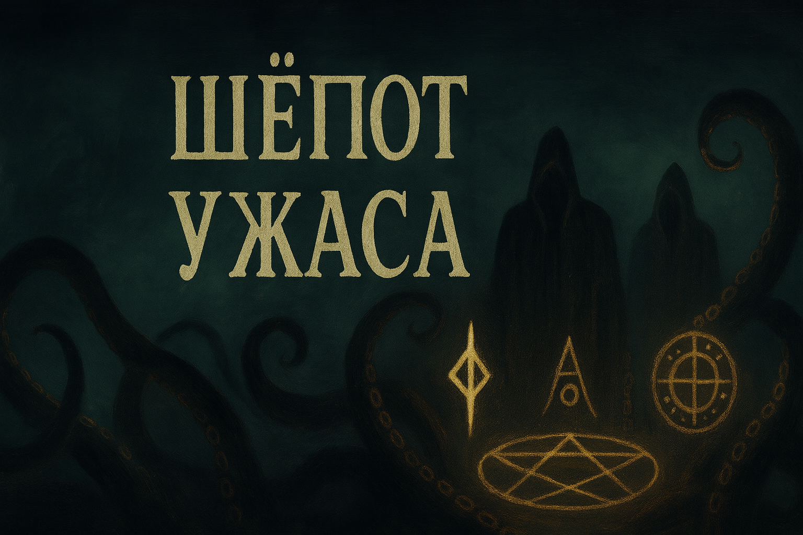

# Шёпот Ужаса

Минималистичная карточная игра-расследование во вселенной космического ужаса.
Игроку предстоит балансировать между двумя треками — победы и поражения,
управляя небольшой колодой мирных действий и реагируя на события, которые постепенно
разрушают тело, рассудок и окружающую реальность.

Игровой процесс

Каждый ход игрок получает 3 очка действия и 3 карты.

Слева — личная колода игрока.

Справа — колода событий.

По центру — абстрактное поле: здоровье, рассудок, время суток, активные эффекты, NPC.

Два трека отражают прогресс:

Трек расследования → победа.

Трек разрушения → поражение.

Лог описывает происходящее литературным стилем.

Основные механики

Исследование, сбор улик, взаимодействие с NPC.

Случайные события, которые меняют условия и заставляют адаптироваться.

Мирные карты создают цепочки действий и собирают стратегию.

Баланс между риском, ресурсами и приближением к бездне.

Цель

Собрать достаточно улик и выдержать натиск ужаса,
прежде чем город или собственный разум погубят следователя.

